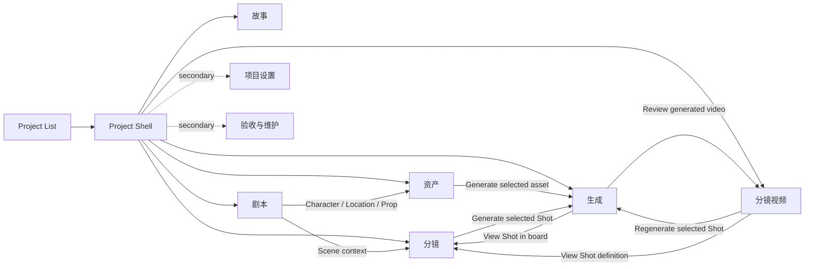

# Creator UI Screen Map

Status: 0.8 Creator UI Baseline v1 · design only

## 1. Product-level map

```text
Project List
│  ├─ Create Project
│  ├─ Open Project
│  ├─ Rename Project
│  └─ Delete Project
│
└─ Project Shell
   ├─ 故事
   ├─ 剧本
   ├─ 资产
   ├─ 分镜
   ├─ 生成
   └─ 分镜视频

Secondary destinations
   ├─ 项目设置
   └─ 验收与维护

Global project surfaces
   ├─ Context Inspector
   ├─ 制作任务 Drawer
   ├─ Confirmation Dialog
   └─ Source Details
```

Project List is outside Project Shell. Opening a project enters the last valid creative stage when known; otherwise it enters 故事. Project selection is not a permanent seventh stage.

## 2. Project Shell map



## 3. Screen responsibilities

| Screen | Primary content | Primary selection | Main action | Secondary exits |
| --- | --- | --- | --- | --- |
| Project List | Recent/all projects | Project | 新建项目 / 打开项目 | Rename, delete |
| 故事 | Concept, synopsis, genre, style, world, requirements | Story/Project | 编辑故事 | 剧本 |
| 剧本 | Episode/Scene tree and structured editor | Scene | 新建/编辑场次 | 资产, 分镜 |
| 资产 | Character/Location/Prop tabs and dense cards | Asset | 创建资产 / 设为主参考 | 生成, related Scene |
| 分镜 | Compact Shot Board | Shot | 新增镜头 / 编辑镜头 | 生成, referenced Asset |
| 生成 | Shot Queue, generation description, candidate result | Shot or Candidate | 生成 / 审核结果 | 分镜, 分镜视频 |
| 分镜视频 | Shot list, player, candidate comparison, sequence strip | Shot video/Candidate | 设为当前镜头视频 | 生成, 分镜 |
| 项目设置 | Tools, models, credentials, ComfyUI, providers, storage | Setting group | 保存设置 | Return to preserved stage |
| 验收与维护 | Readiness, runtime, backup, diagnostics, versions | Maintenance item | Contextual maintenance action | Return to preserved stage |

## 4. Context graph

```text
Project Context
├─ Script Context
│  └─ Scene Context
│     ├─ Asset Context
│     │  └─ Candidate Context
│     └─ Shot Context
│        ├─ Keyframe Candidate Context
│        └─ Video Candidate Context
└─ Global Task Context (references any context above)
```

Project is always retained inside Project Shell. Scene, Shot, Asset and Candidate are optional and must be validated against the current Project before reuse.

## 5. Shot context transitions

| From | User action | To | Preserved context |
| --- | --- | --- | --- |
| 剧本 / Scene | 查看分镜 | 分镜 | Project + Scene; first/last selected Shot if valid |
| 分镜 / Shot 08 | 生成关键帧 | 生成 | Project + Scene + Shot 08; generation type keyframe |
| 分镜 / Shot 08 | 生成视频 | 生成 | Project + Scene + Shot 08; generation type video |
| 生成 / Shot 08 | 查看分镜 | 分镜 | Project + Scene + Shot 08 |
| 生成 / video candidate | 查看镜头视频 | 分镜视频 | Project + Scene + Shot + Candidate |
| 分镜视频 / Shot 08 | 重新生成 | 生成 | Project + Scene + Shot 08; current official video unchanged |
| 分镜视频 / Shot 08 | 查看镜头定义 | 分镜 | Project + Scene + Shot 08 |

If the selected Shot no longer exists, keep Project and Scene when valid and show a short explanation before selecting the nearest valid item. Never silently reuse an ID from another project.

## 6. Asset context transitions

| From | User action | To | Preserved context |
| --- | --- | --- | --- |
| 剧本 / Character mention | 查看角色 | 资产 · 角色 | Project + Scene + Asset |
| 剧本 / Location | 查看场景资产 | 资产 · 场景 | Project + Scene + Asset |
| 分镜 / Shot reference | 编辑资产 | 资产 relevant tab | Project + Scene + Shot + Asset |
| 资产 / selected Asset | 生成参考图 | 生成 | Project + Asset; generation type image |
| 生成 / asset candidate | 返回资产 | 资产 | Project + Asset + Candidate |
| 资产 / candidate | 查看来源 | Same page SourceDetails | Project + Asset + Candidate |

Asset sources are unified. An imported image, Packy result and ComfyUI result are versions/candidates of the same Asset rather than separate pages.

## 7. Candidate context transitions

```text
Generate result
  ├─ Compare with current official version
  ├─ Approve
  ├─ Reject
  ├─ Adopt
  │   ├─ Asset → 设为主参考
  │   ├─ Shot image → 设为镜头关键帧
  │   └─ Shot video → 设为当前镜头视频
  ├─ Regenerate → new Candidate, official version unchanged
  └─ Source
      ├─ Tool / Model / Time / Cost / Workflow summary
      └─ Technical Details
          ├─ GenerationRecord
          ├─ WorkflowRun / StepRun
          ├─ PromptPackage
          ├─ RoutingDecision
          └─ versions / immutable IDs
```

Review and adoption stay within the current Asset/Shot context. There is no standalone review backend in primary navigation.

Adoption feedback is immediate: the adopted candidate becomes 已确认 and a short toast confirms 已设为主参考、已设为镜头关键帧 or 已设为当前镜头视频 according to the target.

## 8. Task Drawer map

```text
Collapsed: N 个任务进行中 · M 个等待确认
Expanded
├─ 当前上下文
│  ├─ Target name
│  ├─ Human action
│  ├─ Status / progress
│  └─ Valid next action
└─ 其他制作任务
   ├─ Filter: 进行中 / 等待用户 / 失败 / 完成
   └─ Source / technical details on demand
```

Selecting a task navigates to its creative target when possible. It does not navigate to a GenerationRecord page.

## 9. Settings and Maintenance return rule

Opening Settings or Maintenance stores the current creative location conceptually. Closing or choosing “返回制作” restores module, Scene/Shot/Asset selection and scroll focus when the object still exists. These secondary destinations never reset the creator to Project List.

## 10. Empty and error routes

- No Project: Project List gives 新建项目 as the single primary action.
- Story empty: prompt the creator to write the one-line concept.
- Script empty: 新建剧本 or 导入剧本.
- Assets empty: create the first asset in the selected tab.
- Storyboard empty: create the first Shot or return to a Scene needing breakdown.
- Generate not ready: show the missing input and link to the exact Asset/Shot field.
- Tool unavailable: explain the unavailable generation method and link to Settings; do not expose raw transport errors by default.
- Candidate failed: keep the current official version and show retry/edit options when valid.

## 11. Current-to-screen ownership summary

| Existing capability | New owner |
| --- | --- |
| Project create/open/recent | Project List |
| Project creative description | 故事 |
| Script/Episode/Scene editor and import | 剧本 |
| Character/Location/Prop Bible + references | 资产 |
| Storyboard/Shot plan/continuity/keyframe state | 分镜 |
| Direct Tool + Workflow generation | 生成 |
| Current/candidate Shot video review | 分镜视频 |
| AI/visual/video/workflow tasks | TaskDrawer |
| Tool/model/credential/provider configuration | 项目设置 |
| Readiness/runtime/backup/diagnostics/provenance audit | 验收与维护 |
