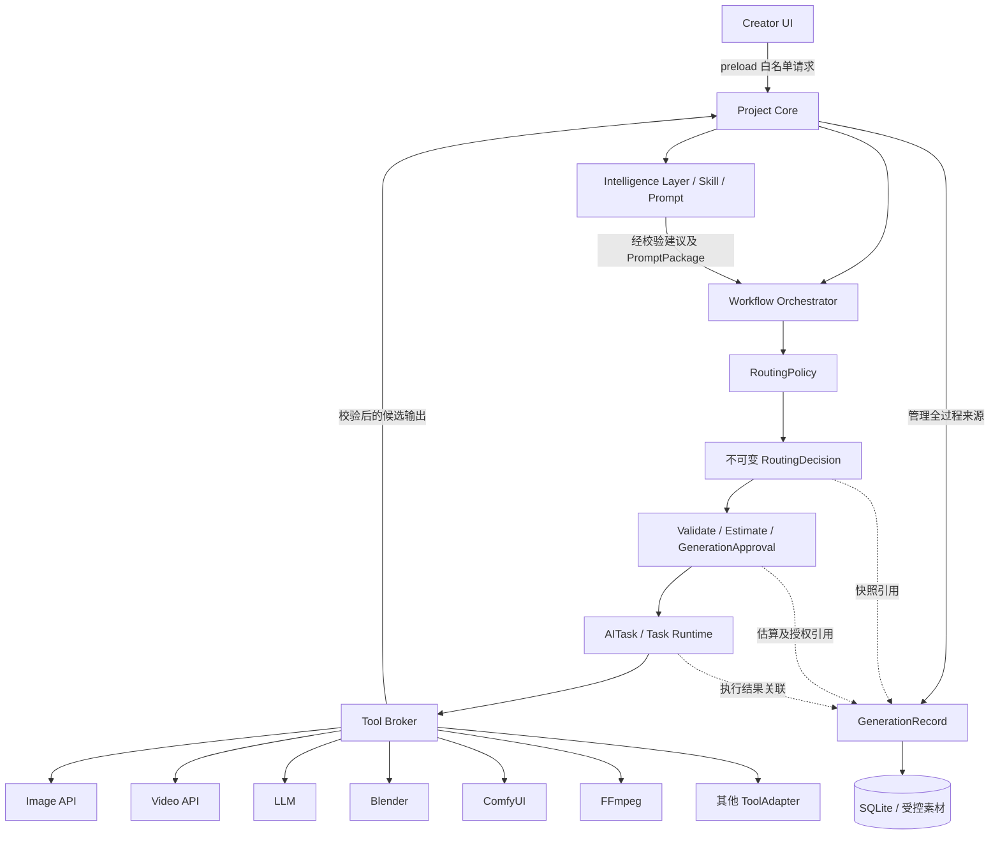

# Architecture Baseline v2

Status: Approved for implementation

产品：AI ShortDrama Director · AI 短剧一站式工作流。批准日期：2026-09-13。

本基线批准的是实施方向及契约，不表示新增平台能力已经实现。代码基线为 0.6.0。施工顺序和迁移门槛以 [implementation-roadmap-v2.md](implementation-roadmap-v2.md) 为准；早期 tool-protocol-phase-a.md 草案不再作为施工依据。本轮只定稿文档，不改业务代码、数据库、UI、Provider、版本或安装包。

## 1. 产品主线与界面边界

**故事 → 剧本 → 资产 → 分镜 → 生成 → 分镜视频**

| 阶段 | 职责 | 产物 |
| --- | --- | --- |
| 故事 | 创意、故事导入、大纲、人物关系 | 可追踪故事简报 |
| 剧本 | 分集、场次、对白、动作及拆解审核 | Script / Episode / Scene |
| 资产 | 角色、场景、道具描述及参考素材选择 | Bible / Asset / 已采用 AssetVersion |
| 分镜 | 镜头顺序、构图、机位、动作及关键帧 | Storyboard / Shot / 关键帧 |
| 生成 | 生成参数、执行、任务进度、费用授权 | AITask / 候选结果 / GenerationRecord |
| 分镜视频 | 结果查看、版本比较、采用、导出 | Shot 的正式视频绑定与导出清单 |

PromptPackage 是内部正式、可版本引用的对象。普通模式只显示可折叠的“生成描述”，Advanced Mode 才开放完整 Prompt。重新生成从结果页进入生成阶段，不创建另一套任务机制。

各阶段共享一个项目。用户可导入已有剧本、资产或视频，缺少前置条件就地提示；资产与分镜允许往返，不强制先生成所有资产才能编辑文本分镜。故事阶段的新能力不冒充 0.6.0 已有实现。本轮范围止于确认的分镜视频及清单导出，不含最终成片制作。

## 2. 总体架构

所有工具为并列 ToolAdapter，ComfyUI 是可选工具，不是默认核心生产链。预检由应用层通过受控 Broker 调用 adapter 的只读动作，不绕过权限；生成 submit 仅在创建 AITask 后由 Runtime 经 Broker 执行。

Project Core 独占正式对象、审核、素材登记和数据库写入；Intelligence 提供领域建议与编译结果；Workflow Orchestrator 管依赖与人工关卡；RoutingPolicy 只决策；Task Runtime 管实际执行；Broker 管权限、输入准备与输出收集。

SQLite、密钥和系统文件能力保持在主进程侧，renderer 不获得原始 IPC、SQL 或任意 shell/文件接口。耗时计算在工具环境中执行，网络等待异步处理，不持有数据库长事务。

## 3. 扩展对象

| 对象 | 职责 |
| --- | --- |
| SkillPackage | 制作方法、领域指令、模板、输入输出 schema 和评估样例；纯文本不执行代码 |
| Capability Contract | 某种业务能力的版本化输入输出与约束 |
| ToolAdapter | 将原生工具接口映射到生命周期及其实现的能力契约 |
| WorkflowTemplate | 串联能力、Skill、依赖、参数映射及人工关卡 |
| PromptPackage | 冻结语义上下文、编译文本、来源及编译器/Skill 版本 |
| ViewExtension | 使用统一项目 API 的可选视图 |

扩展清单声明 id、version、hostApiVersion、kind、能力契约版本、依赖、内容哈希、运行方式、权限、资源需求和许可。SKILL.md、MCP 或外部插件是适配来源，不意味着任意格式可直接执行；带脚本的 Skill 必须进入工具执行边界。首期只有受信 adapter 与声明式配置，不加载任意第三方 UI。

## 4. Tool Protocol 与 Capability Contract

Tool Protocol **只统一生命周期**，不统一具体业务参数；禁止 UniversalToolRequest 或装满可选字段的万能业务请求。

| 动作 | 责任 |
| --- | --- |
| describe | 版本、能力契约版本、约束与资源需求 |
| health | 工具可达性、依赖/凭据状态和检查时间，不提交生成 |
| validate | 检查输入、能力、模型限制、依赖、权限、授权条件，不产生生成任务 |
| estimate | 费用、币种、时间范围、付费可能性、依据、有效期、requestFingerprint，不产生生成任务 |
| submit | 在预检及授权有效时提交，返回确定结果或外部任务句柄 |
| status | 查询实际任务进度与状态 |
| result | 取得输出清单或受控句柄，尚不是正式绑定 |
| cancel | 表达已停止计算、仅停止等待或不支持；不能影响不属于本应用的任务 |
| recover | 依据明确外部 ID 恢复查询/取回，不等于重新提交；不支持必须明确返回 |

生命周期可使用共享执行上下文（taskId、projectId、deadline、AbortSignal、授权输入句柄），但业务载荷由选定 Capability Contract 校验，不能退化成任意 JSON。

| Capability Contract | 独立业务输入/输出示例 |
| --- | --- |
| text.structured | 文本上下文、目标 schema → 结构化结果 |
| image.generate | 生成描述、画幅等 → 图像候选 |
| image.referenceGenerate | 参考 AssetVersion 及用途 → 图像候选 |
| video.textToVideo | 生成描述、时长 → 视频候选 |
| video.imageToVideo | 首帧/可选尾帧、动作 → 视频候选 |
| scene.previz | 场景模板、机位、构图 → 预演参考 |
| scene.render | 场景引用、渲染要求 → 渲染素材 |
| media.transcode | 媒体版本、目标格式 → 转换素材 |

Adapter 可实现多个能力；工具专属参数由能力契约允许的已注册 schema 表达。HTTP、WebSocket、CLI 在 adapter 内转换；同步图片和异步视频共用生命周期，不强制共享业务字段。

## 5. 预检、估算与请求身份

**validate = 能不能做；estimate = 大概多少钱；approval = 用户是否允许花费；submit = 真正执行。**

Validate 返回 valid、结构化 issues（字段、原因、严重程度）、检查时间、请求指纹和路由引用。检查授权条件不等于授予费用权限。

Estimate 是不可变快照，至少包含 id、projectId、routingDecisionId、requestFingerprint、estimatedCost、currency、durationRange、mayCharge、basis、createdAt、expiresAt。费用或耗时无法确定必须显式 unknown，不能填 0；0 只表示有依据的零费用。金额使用确定精度表达；本地计算成本不能虚构成某种货币。耗时区间不是完成保证。

requestFingerprint 由主进程对规范化的能力及版本、来源 revision、素材版本、工具/模型、最终 Prompt、参数、seed 和 RoutingDecision 身份生成，不含密钥。输入、模型、参数或 RoutingDecision 改变后，validate / estimate 必须失效并重做。队列等待后，submit 前再次核对权限、依赖和有效期。

预检不生成、不下载模型、不静默上传素材到未授权服务。如果服务没有无生成副作用的估价能力，返回 unknown。网络查询隐私许可与费用授权是不同权限。

## 6. RoutingPolicy 与 RoutingDecision

执行关系：

**Workflow Orchestrator → RoutingPolicy → RoutingDecision → validate → estimate → GenerationApproval（需要时）→ AITask → Tool Broker → ToolAdapter**

RoutingPolicy 是纯决策逻辑，不执行工具、不提交任务。Orchestrator 提供经受控发现获得的候选描述、健康快照、价格依据和资源状态。资料过期或不足时可返回阻塞/需刷新，不能冒充通过。

AUTO 先过滤硬约束：capability、privacy、local/cloud、budget、availability、resource requirements，再比较 cost、speed、quality 偏好。严格预算下费用未知不能自动通过；不同币种无明确转换依据不可直接排序；无可靠适用的质量评价时必须 unknown，不按工具名称编评分。路由时资源可用不代表执行时已经预留，Runtime 还要检查和预留。

固定 Tool 不得静默替换。AUTO 在付费提交状态不明时不得切换其他工具再次提交。请求选择优先于项目策略，项目策略优先于应用默认值；隐私与费用许可不能被普通偏好覆盖。

RoutingDecision 为不可变快照：

| 字段 | 含义 |
| --- | --- |
| id / projectId | 决策身份与项目边界 |
| workflowRunId / stepRunId | 编排关联；独立任务可空 |
| requestedCapability | 能力 ID 与契约版本 |
| routingMode | AUTO 或固定 Tool |
| selectedToolId / selectedToolVersion / selectedModel | 工具、版本、模型（不适用时空） |
| decisionReasons / rejectedCandidates | 选择和排除理由 |
| hardConstraints / preferenceInputs | 本次规则输入快照，含未知评价及资料时间 |
| createdAt / policyVersion | 时间与策略版本 |

无候选时返回阻塞，不制造有效选择。最终预检拒绝候选时，可在提交前重新决策，但不能修改原快照；新决策重走预检及授权。工具专用 Prompt 在选择工具后、最终 validate 前编译。候选目录价格仅辅助筛选，最终 estimate 才用于费用授权。

GenerationRecord 引用 routingDecisionId，素材详情能回答“为什么这次用了这个工具/模型”。

## 7. GenerationApproval

由主进程在明确用户操作后建立，不由 Skill/adapter 自动批准。

至少包含：id、projectId、requestFingerprint、routingDecisionId、estimateId、currency、maxAuthorizedCost、scope、approvedAt。scope 区分单次任务与批次预算；可附有效期、撤销状态和消费记录，但不能改已批准范围。

单次授权绑定一个最终请求。批次授权绑定不可变批次清单和整体指纹：清单逐项保存请求指纹、routingDecisionId、estimateId，顶层引用不可变批次路由/估算汇总。不能用单镜头的决策和报价冒充整批。批次限定同币种预算，不同币种拆分授权。

提交前原子预留额度，保证并发总额不超上限。未知付费提交继续占用预留直到核对，不能立即释放后再次消费；明确未计费失败才释放。实际费用后补，不由未知变零。无法取得可信执行费用上限时阻塞严格上限授权；不能声称本地预算能限制远端任意计费。

输入、模型、Tool、RoutingDecision 变化，估算过期或费用超范围时，旧 Approval 失效。批次清单变更需要新授权；在途任务保留原审计和预留，失效阻止新消费。validate 通过绝不代表付费授权。真实付费 API 测试必须单独获得用户授权。

## 8. WorkflowRun、StepRun、AITask 与 GenerationRecord

职责锁定：

- WorkflowRun：模板及版本、项目、输入快照和整体运行。
- **StepRun = 工作流走到哪里**，包括依赖、blocked、waiting-for-review 和任务关联。
- **AITask = 执行任务现在是什么状态**，负责 queued/running/succeeded/failed/cancelled 及轮询调度。
- **GenerationRecord = 这次生成到底怎么发生**，仅记录来源与尝试结果，不能成为新队列。

GenerationRecord 由 Project Core 管理，最小字段：

| 字段组 | 字段 |
| --- | --- |
| 身份 | id、projectId、targetObjectId、generationType |
| 来源 | sourceRevisions、inputAssetVersionIds |
| 制作方法 | skillId / skillVersion、workflowTemplateId / workflowVersion、promptPackageId |
| 路由工具 | routingDecisionId、toolId / toolVersion、modelId |
| 条件 | parameters、seed |
| 费用 | estimateId、approvalId、estimatedCost、actualCost、currency、costStatus |
| 执行 | taskId、parentGenerationRecordId、attemptType（initial / retry / regenerate） |
| 时间 | startedAt、completedAt、actualDuration；补充 createdAt / updatedAt |
| 结果 | outputAssetVersionIds、outcome、失败摘要 |

actualDuration 表示执行耗时；视频时长另在媒体元数据。Skill/模型/seed 不适用时为空，不伪造版本；costStatus 区分 unknown/pending/known。无费用授权需要时 approvalId 可空，预检仍须记录。

实际生成尝试创建新记录，失败和取消也保留。查询状态、恢复下载沿用原记录，不算新尝试。0.6.x 同一 AITask 上的历史 retry 不改写，兼容读取并标记来源不完整；新路径每次实际重提创建新 AITask 和记录，父记录连接 retry/regenerate 链。

输入快照不可变，执行结局、耗时和结算可追加补齐并保留依据。outcome 仅描述结局/未知，不负责 polling、retry queue 或 scheduling。一次尝试可以多输出或无输出。文本 Draft 用额外类型化输出引用关联，不伪造 AssetVersion。

导入资产使用独立 **Import Provenance**（来源方式、时间、哈希、输出版本及可用说明），不得伪装成 AI GenerationRecord。旧生成素材无充分证据时标记 legacy/来源不完整，不补造授权、报价或模型。记录不保存密钥或认证正文。

## 9. 人工确认、事务与恢复

**AI Text → Draft → Human Confirm → Formal Project Object**

**Image / Video → Candidate AssetVersion → Human Review → Adopt → Formal Binding**

Tool 输出永远先进入候选状态。任何工具不得直接改正式 Shot / Asset binding。工具执行在事务外，输出进入暂存区；核心校验格式、尺寸、路径后提交候选版本、来源关联和任务结果。文件与 SQLite 不是统一事务，沿用暂存、补偿及孤儿扫描；正式绑定只在人工操作事务中更新。

执行前及结果接收前核对源 revision。源变化时保留已采用版本，旧结果不自动绑定；按能力策略标记过期候选或拒绝并解释。单镜头失败不回滚其他成功镜头。

未知远端提交保留 intent/回执及额度预留，不自动重提。已知外部任务只查询/下载；历史丢失需人工核对。取消后迟到输出不覆盖正式结果。工具/模型/Skill 版本缺失时阻塞恢复，不静默替换重跑。

## 10. Canvas 定位

Canvas = Creator UI ViewExtension。本轮不实现。

只能引用 Scene、Shot、Character、Location、Prop、Asset、AssetVersion；只保存 position、group、connection、layout、view state。连线表达视图关系，不建立另一套编排/业务实体。业务修改经同一 Project Core API，不复制数据或素材版本。

## 11. Tool Runtime 运行边界

Electron renderer sandbox 与 Tool Runtime 隔离分别描述。普通独立进程和虚拟环境只有部分依赖/故障隔离，不是完整安全沙盒。

保持私有任务目录、输入授权、输出暂存、结果校验、路径防越界、主进程凭据、timeout、cancel、logs、crash isolation。校验实际解析路径，防范符号链接/Windows 重解析点绕过。worker 不读取整个 userData，密钥只由受信连接器按需使用，不广播给所有 worker。

外部连接模式只连接用户服务，不负责关闭，也不能限制其自身插件权限。托管模式只管理本应用启动的进程、就绪超时、端口、日志和退出，不终止他人 ComfyUI/Blender。本地 GPU 先保守串行，再按资源声明限流。

开放不可信代码前必须验证操作系统级文件/网络/子进程强制限制，或有证据的容器/虚拟机隔离；此前明确标识受信执行。不能假定全部 GPU 工具都可使用同一种隔离方式。

保留稳定 userData、media 和 credentials。新增 extensions/{id}/{version}、runs/{runId}/{stepId} 和运行环境记录只在施工时创建。大模型/工具可在用户授权的其他磁盘，不固定开发盘符、不静默下载。版本并存，运行固定版本，移除前检查引用。

## 12. 实施顺序、版本与冻结范围

验证顺序：**Tool Protocol → 模拟工具契约测试 → 第三方 Image API → 第三方 Video API → ComfyUI Adapter → Blender Adapter**。

模拟不等于真实 API/GPU 验收；真实付费测试单独授权。ComfyUI 图须附模型/节点要求、参数映射、输出约定和测试样例，不复制 minimax-h3 的 .pyd 或整个整合包作为核心。

| 版本目标 | 范围 |
| --- | --- |
| 0.6.x | 架构冻结与兼容修复 |
| 0.7.0 | Tool / Capability / Routing / GenerationRecord 基础、预检/授权、API 首次适配及其后的 ComfyUI 桥接 |
| 0.8.0 | Creator UI 重构 + 可选 Canvas |
| 0.9.0 | Blender + 多 Image / Video Tool |
| 0.9.5 | 真实生产验收 |
| 1.0.0 | 达到验收门槛后的正式稳定版本 |

本轮不修改 package version。版本是交付门槛，不是预定日期。外部依赖或付费授权未满足时，不用 Mock 冒充完成。

继续暂缓：插件市场、任意第三方 UI、通用节点编辑器、分布式调度、微服务拆分、自动下载全部模型、剪辑时间线、字幕/BGM/混音、最终成片制作。
